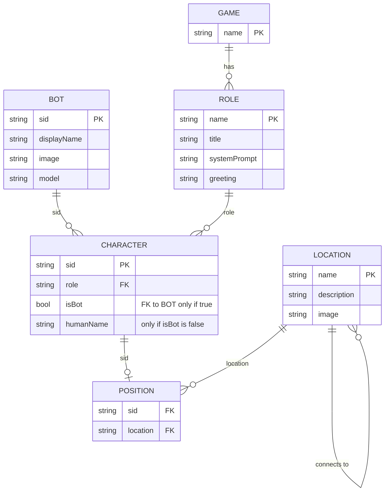

# Game Entity Relationship Diagram

```mermaid
erDiagram
    BOT {
        string sid PK
        string displayName
        string image
        string model
    }
    LOCATION {
        string name PK
        string description
        string image
    }
    GAME {
        string name PK
    }
    ROLE {
        string name PK
        string title
        string systemPrompt
        string greeting
    }
    CHARACTER {
        string sid PK
        string role FK
        bool isBot "FK to BOT only if true"
        string humanName "only if isBot is false"
    }
    POSITION {
        string sid FK
        string location FK
    }

    LOCATION ||--o{ LOCATION : "connects to"
    GAME ||--o{ ROLE : has
    BOT ||--o{ CHARACTER : sid
    ROLE ||--o{ CHARACTER : role
    CHARACTER ||--o| POSITION : sid
    LOCATION ||--o{ POSITION : location
```
