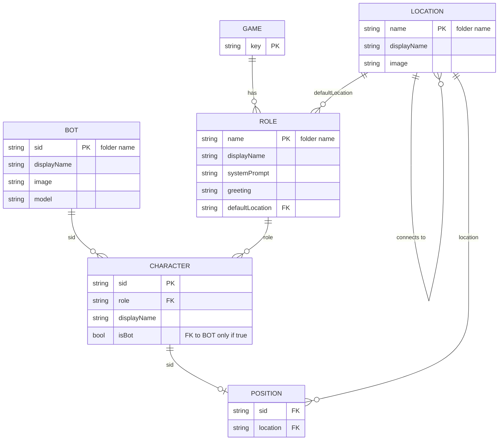

# Game Engine

A multi-character world where humans and bots share a small set of locations, roles, and conversation memory. This document explains the design — not the file layout, which `ls Game/` shows you.

## The filesystem is the database

Bots, Roles, and Locations are not stored in a DB or a registry. Their folder on disk *is* the record, and the folder name *is* the identifier. There is no `sid` or `name` field inside `config.json` — duplicating it would invite drift. Adding a bot is `mkdir Game/Bots/<sid>` plus a `config.json`; deleting one is `rm -rf`. The engine never indexes; it scans.

This shapes everything downstream. References like a role's `defaultLocation`, a location's `connects_to`, or a position record are all folder-name strings — they survive a code rename because they're just paths. The tradeoff: spaces and exotic characters in identifiers are awkward, so we use `displayName` in config for the pretty label and accept that the id is whatever-the-folder-is-called.

## Images are auto-thumbnailed

Bot and location images can be full-resolution source files. The first time something needs a thumbnail (`bot_list`, `location_list`, map rendering), `_ensure_thumb()` generates a width-360 JPEG next to the source — by convention `image.png` → `image_thumb.jpg` — and caches it on disk. Subsequent reads reuse the cached thumb unless the source mtime is newer. Don't commit the thumbs by hand or keep them in sync manually; let the engine manage them.

## Two state layers

There are two completely separate kinds of data, and conflating them causes pain:

- **Assets** (`Game/`) — shared across every game, version-controlled, hand-edited. Bots, Roles, Locations. Read-only at runtime.
- **Runtime state** (`Data/games/<game_key>/`) — per-game, written by the engine, never edited by hand. `characters.json` (who is playing), `positions.json` (where they are), `interactions/` (conversation memory), `game.json` (metadata).

A single asset (e.g. the `kitty` bot) can participate in many games simultaneously; each game has its own character record, position, and conversation history for that bot. Don't write game-specific state into `Game/`; don't put shared definitions in `Data/`.

## `game_key` is always explicit

Every function that touches runtime state takes `game_key` as a parameter. There is no implicit "current game" via `session_shared` or a global — and there shouldn't be. Multiple games can be live in one server, and the only way to tell them apart is the key the caller passes.

## Characters are roles, not bots

A bot is a *driver* (model config and image — nothing else). A character is a *participant in a specific game*, bound to a role. System prompts and greetings live on the role, not the bot — swap the bot driving a role and the personality doesn't change. The relationship is loose:

- Same sid + different game = different character record (different role/position possible).
- Bot-driven vs human-driven is determined dynamically by `is_bot_driven()`: if there's a bot config for the sid AND no live human session has claimed that sid's chat slot, the bot drives. A human can take over a bot's sid by claiming it.

The role is what carries the system prompt and greeting. The bot just supplies the LLM and the face.

## Movement: first entry is special

`character_move` has two distinct modes:

1. **First entry** — no position record yet. The character *must* spawn at their entry location (their role's `defaultLocation`, falling back to the location with `"default": true`). Passing any other location raises. This is the only way to enter the world.
2. **Subsequent moves** — `connects_to` adjacency is enforced. You can only go to a location that the current location lists as reachable. No teleporting between disconnected rooms.

## Conversation memory is per-role-per-speaker

This is the most non-obvious part. Bot memory is keyed at `Data/games/<game_key>/interactions/<role>/<speaker_sid>.json`. Implications:

- Two characters playing the **same role** share one memory of you. The Receptionist remembers you the same way regardless of which bot is currently driving Receptionist.
- The **same bot** playing different roles in different games has separate memories per role.
- The role is the "personality slot"; the bot is the voice; the memory belongs to the slot, not the voice.

If you want a bot to remember you across role changes, that's not how this is designed.

## ER diagram

