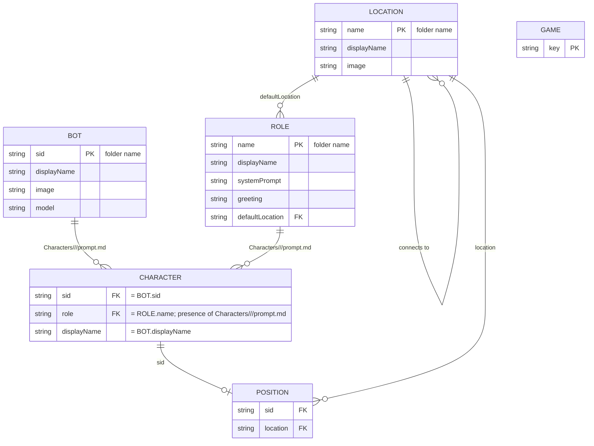

# Game Engine

A multi-character world where humans and bots share a small set of locations, roles, and conversation memory. This document explains the design — not the file layout, which `ls Game/` shows you.

## The filesystem is the database

Bots, Roles, and Locations are not stored in a DB or a registry. Their folder on disk *is* the record, and the folder name *is* the identifier. There is no `sid` or `name` field inside `config.json` — duplicating it would invite drift. Adding a bot is `mkdir Game/Bots/<sid>` plus a `config.json`; deleting one is `rm -rf`. The engine never indexes; it scans.

This shapes everything downstream. References like a role's `defaultLocation`, a location's `connects_to`, or a position record are all folder-name strings — they survive a code rename because they're just paths. The tradeoff: spaces and exotic characters in identifiers are awkward, so we use `displayName` in config for the pretty label and accept that the id is whatever-the-folder-is-called.

## Images are auto-thumbnailed

Bot and location images can be full-resolution source files. The first time something needs a thumbnail (`bot_list`, `location_list`, map rendering), `_ensure_thumb()` generates a width-360 JPEG next to the source — by convention `image.png` → `image_thumb.jpg` — and caches it on disk. Subsequent reads reuse the cached thumb unless the source mtime is newer. Don't commit the thumbs by hand or keep them in sync manually; let the engine manage them.

## Two state layers

There are two completely separate kinds of data, and conflating them causes pain:

- **Assets** (`Game/`) — shared across every game, version-controlled, hand-edited. Bots, Roles, Locations, *and the (sid × role) bindings themselves*. Read-only at runtime.
- **Runtime state** (`Data/games/<game_key>/`) — per-game, written by the engine, never edited by hand. `positions.json` (where characters are), `interactions/` (conversation memory), `game.json` (metadata).

A single asset (e.g. the `kitty` bot) can participate in many games simultaneously; each game has its own position and conversation history for that bot. Don't write game-specific state into `Game/`; don't put shared definitions in `Data/`.

## `game_key` is always explicit

Every function that touches runtime state takes `game_key` as a parameter. There is no implicit "current game" via `session_shared` or a global — and there shouldn't be. Multiple games can be live in one server, and the only way to tell them apart is the key the caller passes.

## Characters are roles, not bots

There are three axes of prompt content, and they each have a home:

- **Bot persona** (`Bots/<sid>/config.json` → `persona`): who this bot *is*, regardless of role. Identity, look, voice, mannerisms. Travels with the bot across role swaps.
- **Role base** (`Roles/<role>/system_prompt.md`): how *anyone* plays this role. Job description, tools, procedures, expected behavior. Travels with the role across bot swaps.
- **Character prompt** (`Characters/<sid>/<Role>/prompt.md`): how *this bot* plays *this role* — the (sid × role) join. Stuff like "you're brand new and rely entirely on your console" lives here, because newness is a property of *Kitty playing Receptionist*, not of Kitty in general or of Receptionists in general. The *existence* of this folder is also what declares the binding: there is no runtime registration step and no `characters.json`. To cast Kitty as Receptionist, create `Characters/kitty/Receptionist/prompt.md`; to swap roles, move the folder.

At prompt time, all three are composed: `persona` + role base + character prompt + time + interaction context. Don't cross the streams — bot identity belongs to the bot, role behavior belongs to the role, the specifics of this casting belong to the bot-role file.

Bot-driven vs human-driven is determined dynamically by `is_bot_driven()`: if there's a bot config for the sid AND no live human session has claimed that sid's chat slot, the bot drives. A human can take over a bot's sid by claiming it.

The role is what carries the system prompt and greeting. The bot just supplies the LLM and the face.

## Movement: first entry is special

`character_move` has two distinct modes:

1. **First entry** — no position record yet. The character *must* spawn at their entry location (their role's `defaultLocation`, falling back to the location with `"default": true`). Passing any other location raises. This is the only way to enter the world.
2. **Subsequent moves** — `connects_to` adjacency is enforced. You can only go to a location that the current location lists as reachable. No teleporting between disconnected rooms.

## Role-level continuity is a gameplay mechanic, not an engine feature

Engine-managed memory belongs to the bot. If a role needs shared continuity across whichever bot is currently driving it — e.g. the Receptionist should always know who has signed in this week — that's modeled in-world: the role has a *tool* it queries (a guest log, an access database, a central computer). The shared store is just another resource the role's system prompt knows how to call.

This keeps the engine boring and the world-building flexible. Personal memory = engine. Institutional memory = gameplay.

## Conversation memory is per-bot-per-speaker

Bot memory is keyed at `Data/games/<game_key>/interactions/<bot_sid>/<speaker_sid>.json`. The memory belongs to the bot, not the role — a bot keeps its own accumulated history of each participant across role changes within a game. Two different bots playing the same role have independent memories of you.

The per-`game_key` scoping still applies: a bot remembers you differently in each game.

## ER diagram

