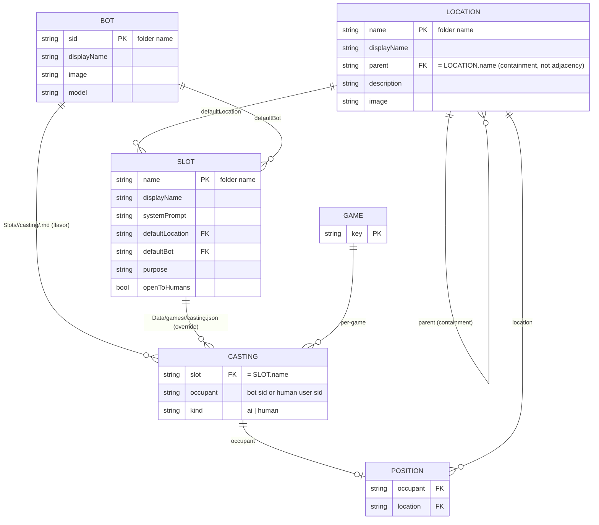

# Game Engine

A multi-character world where humans and AI bots share a small set of locations, slots, and conversation memory. This document explains the design — not the file layout, which `ls Game/` shows you.

## The three nouns

Everything else is built out of these:

- **Bot** (`Game/Bots/<sid>/`) — an AI character: prompt, appearance, image, LLM config. Bots are reusable assets; the same one can be the default for many slots across many games (e.g. one `chad` bot drives `Guest1`…`Guest8`).
- **Slot** (`Game/Slots/<slot>/`) — a *playable unit* in a scenario. The chair at the table. Has a job (`system_prompt.md`), a `defaultLocation`, a `defaultBot`, a `purpose`, and an `openToHumans` flag. The gamer-facing surface: the lobby shows a roster of slots, and you either pick one to play yourself or let the AI play it.
- **Casting** (per game, `Data/games/<game_key>/casting.json`) — who's filling each slot right now. An occupant is either an AI bot sid or a human user sid; absence falls back to the slot's `defaultBot`.

There is no separate "character" entity. A character is just *whoever is currently cast in a slot*, plus the slot's job description.

## The filesystem is the database (for assets)

Bots, Slots, and Locations are not stored in a DB or a registry. Their folder on disk *is* the record, and the folder name *is* the identifier. Adding a bot is `mkdir Game/Bots/<sid>` plus a `config.json`; deleting one is `rm -rf`. References like a slot's `defaultBot`, a location's `connects_to`, or a position record are all folder-name strings — they survive a code rename because they're just paths.

The tradeoff: spaces and exotic characters in identifiers are awkward, so we use `displayName` in config for the pretty label and accept that the id is whatever-the-folder-is-called.

## Images are auto-thumbnailed

Bot and location images can be full-resolution source files. The first time something needs a thumbnail (`bot_list`, `location_list`, map rendering), `_ensure_thumb()` generates a width-360 JPEG next to the source — by convention `image.png` → `image_thumb.jpg` — and caches it on disk. Subsequent reads reuse the cached thumb unless the source mtime is newer. Don't commit the thumbs by hand or keep them in sync manually; let the engine manage them.

## Two state layers

There are two completely separate kinds of data, and conflating them causes pain:

- **Assets** (`Game/`) — shared across every game, version-controlled, hand-edited. Bots, Slots (incl. their default casting), Locations, and per-(bot × slot) casting flavor under `Slots/<slot>/casting/<bot>.md`. Read-only at runtime.
- **Runtime state** (`Data/games/<game_key>/`) — per-game, written by the engine, never edited by hand. `positions.json` (where occupants are), `casting.json` (per-game slot overrides), `interactions/` (conversation memory), `game.json` (metadata).

A single bot (e.g. `kitty`) can participate in many games simultaneously; each game has its own position, casting, and conversation history. Don't write game-specific state into `Game/`; don't put shared definitions in `Data/`.

## `game_key` is always explicit

Every function that touches runtime state takes `game_key` as a parameter. There is no implicit "current game" via `session_shared` or a global — and there shouldn't be. Multiple games can be live in one server, and the only way to tell them apart is the key the caller passes.

## Three layers of prompt content

When the engine drives an AI occupant, three pieces of prose are composed into the system prompt:

- **Bot** (`Bots/<sid>/bot.md` + `appearance.md`): who this AI *is*, regardless of which slot it's filling. Identity, look, voice, mannerisms. Travels with the bot.
- **Slot job** (`Slots/<slot>/system_prompt.md`): how *anyone* plays this slot. Job description, tools, procedures. Travels with the slot.
- **Casting flavor** (`Slots/<slot>/casting/<bot>.md`): how *this bot* plays *this slot* — the (bot × slot) join. Specifics like "you're brand new and rely entirely on the console" live here, because newness is a property of *Kitty playing Receptionist*, not of Kitty in general or of Receptionists in general.

At prompt time, all three are composed: `bot` + slot job + casting flavor + setting + time + interaction context. Don't cross the streams.

## Casting: defaults vs. overrides

Every slot has a `defaultBot` baked into its `config.json`. That's the AI that fills it when nobody has done anything. A per-game override in `casting.json` can:

- swap one AI bot for another (e.g. Natalie covers Receptionist on the night shift instead of Kitty),
- replace the AI with a human (so a human player drives that slot themselves), or
- be cleared, falling the slot back to its default.

The lobby UI is just `slot_list(game_key)`: it returns each slot with its current occupant, kind (`ai` / `human` / `empty`), and source (`default` / `override`). `slot_take(game_key, slot)` claims a slot for the calling user; `slot_release(game_key, slot)` drops the override.

## Bots can fill multiple slots

Nothing prevents one bot from being the default for many slots — Chad-the-bot is the default for `Guest1`, `Guest2`, …, `Guest8`. Each slot is independent in casting, so a human can take `Guest3` while Chad-AI keeps playing the other seven.

> **Note (current limitation):** the runtime occupant id is the bot sid (`chad`), not the slot. That means all eight Chad-driven guests currently share one bot's memory and one position record. Multi-instance bots (per-slot identity for the same AI) are a planned follow-up — see "Known gaps" below.

## Memory is per-occupant

Bot memory lives at `Data/games/<game_key>/interactions/<occupant_sid>/<other_sid>.json`. Memory belongs to the occupant, not the slot — so:

- if **Joe** (`cavallo1`) plays Receptionist, then steps away, then comes back as Manager, Joe carries his memory of every conversation with him,
- if **Kitty** drives Receptionist and is later swapped for Natalie, Natalie starts fresh; she does not inherit Kitty's memories.

The per-`game_key` scoping still applies: a bot remembers you differently in each game.

## Locations have two relationships, not one

`connects_to` is adjacency: where you can walk to from here. `parent` is containment: what this room is inside of. A Lobby has `parent: "Atlantis"` (it's part of the Atlantis facility) and `connects_to: ["Hallway"]` (you can walk into the hallway from here). These are independent.

**Only leaves are standable.** A location with children is a container, not a place you can move to. The engine enforces this on entry, on movement, and on the default-spawn lookup. You can't "go to Atlantis"; you go to Lobby (which is in Atlantis). Containers can hold setting/description without polluting the navigable space.

The `description` field on each location is in-world prose. At prompt time the engine walks from the root down to the occupant's current location and concatenates descriptions in that order — facility context first, room context last — and injects the result as the prompt's `setting` block.

## Movement: first entry is special

`casting_move` has two distinct modes:

1. **First entry** — no position record yet. The occupant *must* spawn at their entry location (their slot's `defaultLocation`, falling back to the location marked `"default": true`). Passing any other location raises. This is the only way to enter the world.
2. **Subsequent moves** — `connects_to` adjacency is enforced. You can only go to a location that the current location lists as reachable.

## Bot-driven vs human-driven

`is_bot_driven(sid)` returns true iff:

1. `sid` is a known bot (has a `Bots/<sid>/config.json`), **and**
2. no live human session has claimed `sid` as its chat slot.

A human can take over an AI bot at runtime by claiming the chat slot. The cleaner way to put a human into the game, though, is `slot_take(game_key, slot)`, which writes the human's user sid into casting and the AI for that slot goes idle automatically.

## Known gaps

- **Multi-instance bots.** One bot can be the default for many slots, but at runtime they share an occupant sid, a position record, and a memory store. Splitting these per-slot (so `chad@Guest1` ≠ `chad@Guest5`) needs a per-slot occupant identity layer. Planned, not built.
- **Scenarios.** Right now there's effectively one scenario baked into the slot list. A future `Game/Scenarios/<name>/slots.json` could parameterize which slots exist, with what defaults, for which storyline (day shift vs. night shift, full hotel vs. lobby-only, etc.).

## ER diagram

